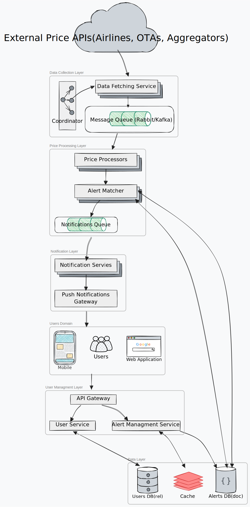

# Flight Price Alert System: Data Structures & Flow

## Design


## Core Data Structures

### 1. User Data
```json
{
  "userId": "uuid",
  "email": "string",
  "name": "string",
  "deviceTokens": ["string"],  // Push notification tokens
  "preferences": {
    "notificationSettings": {
      "pushEnabled": true,
      "emailEnabled": false
    },
    "timezone": "string"
  },
  "createdAt": "timestamp",
  "updatedAt": "timestamp"
}
```

### 2. Alert Configuration
```json
{
  "alertId": "uuid",
  "userId": "uuid",
  "route": {
    "origin": "string",      // Airport code
    "destination": "string", // Airport code
    "departDate": "date",
    "returnDate": "date (optional)"
  },
  "conditions": {
    "maxPrice": "number",
    "airlines": ["string (optional)"],
    "cabinClass": "string (optional)"
  },
  "status": "active | paused",
  "createdAt": "timestamp",
  "updatedAt": "timestamp"
}
```

### 3. Normalized Price Data
```json
{
  "priceId": "uuid",
  "route": {
    "origin": "string",      // Airport code
    "destination": "string", // Airport code
    "departDate": "date",
    "returnDate": "date (optional)"
  },
  "price": "number",
  "currency": "string",
  "airline": "string",
  "cabinClass": "string",
  "flightNumber": "string (optional)",
  "source": "string",        // Which API provided this data
  "timestamp": "timestamp"   // When this price was retrieved
}
```

### 4. Price Match Event
```json
{
  "matchId": "uuid",
  "alertId": "uuid",
  "userId": "uuid",
  "priceData": {
    // Normalized Price Data from above
  },  
  "matchTimestamp": "timestamp"
}
```

### 5. Notification Event
```json
{
  "notificationId": "uuid",
  "userId": "uuid",
  "deviceTokens": ["string"],
  "title": "string",
  "message": "string",
  "data": {
    "alertId": "uuid",
    "route": {
      "origin": "string",
      "destination": "string"
    },
    "price": "number"    
  },
  "status": "pending | sent | failed",
  "createdAt": "timestamp"
}
```

## Data Flow Between Components

### User Management Flow
1. **User → API Gateway**: HTTP requests containing user registration, login, profile updates
2. **API Gateway → User Service**: Validated user management requests
3. **User Service → User Database**: CRUD operations on user data

### Alert Configuration Flow
1. **User → API Gateway**: HTTP requests containing alert creation, updates, deletions
2. **API Gateway → Alert Service**: Validated alert management requests
3. **Alert Service → Alert Database**: CRUD operations on alert configurations
4. **Alert Service → Cache**: Recently accessed or modified alert rules

### Price Collection Flow
1. **Coordinator → Data Fetchers**: Task assignments specifying which routes to check and when
2. **Data Fetchers → External APIs**: HTTP requests to airline, OTA and aggregator APIs
3. **External APIs → Data Fetchers**: Raw price data (JSON/XML)
4. **Data Fetchers → Message Queue**: Normalized price data events

### Price Processing Flow
1. **Message Queue → Price Processors**: Normalized price data events
2. **Price Processors → Alert Matchers**: Processed price data ready for matching
3. **Alert Matchers → Cache/Alert DB**: Query for relevant alert configurations
4. **Alert Matchers → Notification Queue**: Price match events for notifications

### Notification Flow
1. **Notification Queue → Notification Services**: Price match events
2. **Notification Services → Cache/User DB**: Query for user device tokens
3. **Notification Services → Push Gateway**: Formatted push notifications
4. **Push Gateway → User Apps**: Delivered push notifications

## Key Technical Considerations

1. **Data Normalization**: Raw price data from different sources must be normalized into a consistent format.

2. **Event-Driven Architecture**: Uses message queues to ensure reliable processing and decouple components.

3. **Caching Strategy**: 
   - Alert configurations are cached for quick access during matching
   - User device tokens are cached for efficient notification delivery

4. **Coordination Mechanism**: 
   - The Coordinator service manages polling schedules to avoid redundant API calls
   - Ensures all routes are covered while respecting API rate limits

5. **Database Organization**:
   - User data and alert configurations use a relational database with primary-replica setup
   - No price history is stored (per requirements)
